# Quickstart

Get Dotty talking in 15 minutes. This is the single opinionated happy
path -- see [SETUP.md](SETUP.md) for build-from-source and
alternative configurations.

## What you need

| Item | Notes |
|------|-------|
| **M5Stack CoreS3 + StackChan servo kit** | The robot. See [hardware-support.md](hardware-support.md) for details. |
| **Linux or macOS host with Docker** | Runs the voice pipeline. Any distro works. |
| **2.4 GHz WiFi** | The ESP32-S3 does not support 5 GHz. |

## 1. Flash the firmware

Download the latest release from
[GitHub Releases](https://github.com/BrettKinny/dotty-stackchan/releases)
(look for a tag starting with `fw-v`). You need three files:
`stack-chan.bin`, `ota_data_initial.bin`, and `generated_assets.bin`.

Install esptool and flash over USB-C:

```bash
pip install esptool

python -m esptool --chip esp32s3 -b 460800 \
  --before default_reset --after hard_reset \
  write_flash --flash_mode dio --flash_size 16MB --flash_freq 80m \
  0xd000 ota_data_initial.bin \
  0x20000 stack-chan.bin \
  0x610000 generated_assets.bin
```

Verify checksums against `SHA256SUMS.txt` in the release if desired.

## 2. Clone the repo

```bash
git clone --recursive https://github.com/BrettKinny/dotty-stackchan.git
cd dotty-stackchan
```

## 3. Configure

```bash
cp .env.example .env
```

Edit `.env` and set `OPENROUTER_API_KEY=<YOUR_API_KEY>` (or any
OpenAI-compatible key). You can skip this if you're running fully local
— either via Ollama (single binary, simple) or via llama-swap (Docker,
supports multiple resident models). See
[cookbook/run-fully-local.md](cookbook/run-fully-local.md) and
[cookbook/llama-swap-concurrent-models.md](cookbook/llama-swap-concurrent-models.md).

The shipped `.config.yaml` selects `Tier1Slim` as the default LLM,
which expects a llama-swap (or other OpenAI-compatible) endpoint at the
URL pointed to by `LLM.Tier1Slim.url` (and a matching `api_key`). If
that endpoint isn't reachable, either:
- stand up llama-swap (cookbook above), or
- switch `selected_module.LLM` to `OpenAICompat` and point it at any
  cloud OpenAI-compatible API, or
- switch to `ZeroClawLLM` and run the full ZeroClaw agent on a second
  host (see [SETUP.md](SETUP.md)).

## 4. Run setup

```bash
make setup
```

The interactive wizard prompts for your server IP, robot name, timezone,
and LLM provider. It downloads the ASR and TTS models (~100 MB),
substitutes placeholders in config files, and starts the Docker
container.

Verify everything is healthy:

```bash
make doctor
```

All checks should pass (green). If any fail, see
[troubleshooting.md](troubleshooting.md).

## 5. Install the bridge

This step depends on which deployment shape you picked (see the table in the [README](../README.md#get-it-running)).

**Single-host (compose.all-in-one):** the bridge runs as a container in the same compose stack. There is no separate install step — skip to step 6.

**Multi-host (default `make setup`):** install the bridge natively on the host that will run it. From a checkout of this repo *on that host* (not the Docker host):

```bash
sudo scripts/install-bridge.sh \
  --bridge-dir /root/zeroclaw-bridge \
  --zeroclaw-bin "$(which zeroclaw)"
```

The script copies `bridge.py` + the `custom-providers/` and `bridge/` trees into the install dir, creates a Python venv, writes a systemd unit, runs an import smoke test, and starts the service. Health check at `http://<ZEROCLAW_HOST>:8080/health` should return `{"status":"ok",...}`.

If the bridge host is a different machine from the Docker host, clone the repo there first.

## 6. Connect the robot

1. Power on the robot (USB-C or battery).
2. On the device screen, navigate to **Settings > Advanced Options**.
3. Enter the OTA URL: `http://<YOUR_SERVER_IP>:8003/xiaozhi/ota/`
4. The robot connects via WebSocket and shows a face.

## 7. First voice turn

Tap the screen to enter voice mode and say "Hello Dotty!"

You should see:

| LED colour | State |
|------------|-------|
| Green | Listening -- you are speaking |
| Orange | Thinking -- waiting for LLM response |
| Blue | Talking -- playing the response |

The face expression changes to match the response emoji. First-turn
latency is roughly 5 seconds, dominated by the LLM round-trip.

## Next steps

- [Change the persona](cookbook/change-persona.md) -- give Dotty a different personality.
- [Swap the voice](cookbook/swap-voice.md) -- try a different TTS voice.
- [Run fully local](cookbook/run-fully-local.md) -- Ollama compose profile, zero cloud dependencies.
- [Run two local models concurrently](cookbook/llama-swap-concurrent-models.md) -- keep a small voice model and a big "think" model both resident via llama-swap's matrix DSL.
- [Disable Kid Mode](cookbook/disable-kid-mode.md) -- for unrestricted use.
- [Architecture overview](architecture.md) -- full data flow.
- [Kid Mode](kid-mode.md) -- on by default, what it enforces.

---

## Placeholders

This repo uses placeholders in place of real IPs, usernames, and filesystem paths. Substitute these everywhere before deploying:

| Placeholder | Meaning |
|---|---|
| `<XIAOZHI_HOST>` | LAN IP of the server running xiaozhi-server. The robot reaches this on WiFi, so it must be a LAN IP, not a Tailscale/VPN IP. |
| `<XIAOZHI_USER>` | SSH user for the server (whatever your distro defaults to: `root`, `ubuntu`, `dietpi`, etc.). |
| `<XIAOZHI_HOSTNAME>` | Hostname or Tailscale name of the server (optional, IP works for everything). |
| `<XIAOZHI_PATH>` | Path on the server where you clone/install xiaozhi-server (e.g. `/opt/xiaozhi-server/` or `/srv/xiaozhi-server/`). |
| `<ZEROCLAW_HOST>` | LAN IP of the host running ZeroClaw + the bridge. Anything that runs the `zeroclaw` binary works (a small Linux box, your existing home server, or the same server as xiaozhi-server). |
| `<ZEROCLAW_USER>` | SSH user on the ZeroClaw host (whatever your distro defaults to). |
| `<ZEROCLAW_HOME>` | Home directory on the ZeroClaw host for the user that owns the bridge (e.g. `/root/` or `/home/<user>/`). |
| `<BRIDGE_PATH>` | Full path to the zeroclaw-bridge working directory (e.g. `/root/zeroclaw-bridge/`). |
| `<ZEROCLAW_BIN>` | Absolute path to the `zeroclaw` binary (cargo default: `~/.cargo/bin/zeroclaw`). |
| `<ZEROCLAW_CFG>` | ZeroClaw config file path (default: `/root/.zeroclaw/config.toml`). |
| `<YOUR_NAME>` | Your name / org, used in the persona prompt in `.config.yaml`. |
| `<ROBOT_NAME>` | Name the robot introduces itself as, referenced in the persona prompt in `.config.yaml`. Any string — pick whatever you want. The default example uses the hardware name ("StackChan"). |

Port numbers (`8000`, `8003`, `8080`, `18789`, `42617`) are product-generic and should not be changed unless you also reconfigure the respective services.

Files you will definitely need to edit before first run:

- `.config.yaml` — replace `<XIAOZHI_HOST>`, `<ZEROCLAW_HOST>`, and customise the `prompt:` block.
- `docker-compose.yml` — set `TZ` to your timezone.
- `zeroclaw-bridge.service` — only if you're installing the bridge by hand. `scripts/install-bridge.sh` (see step 5) writes its own copy with the right paths and you shouldn't need to touch this file.

---

## Deployment layout

```mermaid
flowchart TB
    subgraph DockerHost_fs["Server filesystem - &lt;XIAOZHI_PATH&gt;"]
        direction TB
        UA1["data/.config.yaml<br/>(override - voice, persona, endpoints)"]
        UA2["models/SenseVoiceSmall/<br/>(model.pt + configs)"]
        UA3["custom-providers/zeroclaw/<br/>(zeroclaw.py + __init__.py)"]
        UA3b["custom-providers/edge_stream/<br/>(edge_stream.py + __init__.py)"]
        UA3d["custom-providers/piper_local/<br/>(piper_local.py + __init__.py)"]
        UA3c["custom-providers/asr/fun_local.py<br/>(patched ASR - language key)"]
        UA4["tmp/<br/>(TTS audio scratch)"]
        UA5["repo/<br/>(git clone, reference only)"]
        UA6["docker-compose.yml"]
    end

    subgraph ZCHost_fs["ZeroClaw host filesystem"]
        direction TB
        RA["&lt;BRIDGE_PATH&gt;"]
        RA1["bridge.py"]
        RA2[".venv/<br/>(fastapi + uvicorn)"]
        RB["/etc/systemd/system/<br/>zeroclaw-bridge.service"]
        RC["~/.zeroclaw/<br/>(agent persona config)"]
        RA --> RA1 & RA2
    end
```



Container volume mounts:

| Host path | Container path | Purpose |
|---|---|---|
| `data/.config.yaml` | `/opt/xiaozhi-esp32-server/data/.config.yaml` | Config override (read-only mount) |
| `models/SenseVoiceSmall/` | `/opt/xiaozhi-esp32-server/models/SenseVoiceSmall/` | ASR weights |
| `models/piper/` | `/opt/xiaozhi-esp32-server/models/piper/` | Piper TTS voice models (`.onnx` + `.json`) |
| `tmp/` | `/opt/xiaozhi-esp32-server/tmp/` | Scratch |
| `custom-providers/zeroclaw/` | `/opt/xiaozhi-esp32-server/core/providers/llm/zeroclaw/` | Custom LLM provider (directory mount) |
| `custom-providers/edge_stream/edge_stream.py` | `/opt/xiaozhi-esp32-server/core/providers/tts/edge_stream.py` | Streaming EdgeTTS provider (file mount) |
| `custom-providers/piper_local/piper_local.py` | `/opt/xiaozhi-esp32-server/core/providers/tts/piper_local.py` | Local Piper TTS provider (file mount) |
| `custom-providers/asr/fun_local.py` | `/opt/xiaozhi-esp32-server/core/providers/asr/fun_local.py` | Patched FunASR — adds `language` config key so SenseVoiceSmall can be pinned to English |

The full file inventory (with `/etc/systemd/system/` paths and the bare-metal venv) lives in [architecture.md](./architecture.md#deployment-files-this-repo).

---

## Endpoints

| What | URL | Who calls it |
|---|---|---|
| OTA (enter into StackChan settings) | `http://<XIAOZHI_HOST>:8003/xiaozhi/ota/` | The robot on boot |
| WebSocket | `ws://<XIAOZHI_HOST>:8000/xiaozhi/v1/` | The robot after OTA handshake |
| Bridge (chat) | `http://<ZEROCLAW_HOST>:8080/api/message` | xiaozhi-server's ZeroClawLLM |
| Bridge (health) | `http://<ZEROCLAW_HOST>:8080/health` | Humans, monitoring |
| Bridge (dashboard) | `http://<ZEROCLAW_HOST>:8080/ui` | Humans (LAN-only HTMX UI) |
| ZeroClaw gateway | `http://127.0.0.1:42617` (host-local) | ZeroClaw's web UI only |

---

## Reboot survival

Both services restart themselves without manual intervention:

| Host | Mechanism |
|---|---|
| Server | Container `restart: unless-stopped` in `docker-compose.yml` + ensure dockerd starts at boot on your distro. |
| ZeroClaw host | `zeroclaw-bridge.service` is `enabled`, `Restart=on-failure`. |

Caveat: if you run `docker compose down`, the container is marked stopped and won't come back on reboot. Use `docker compose restart` or `docker restart xiaozhi-esp32-server` for transient restarts instead.

---

## Common operations

```bash
# Tail xiaozhi-server logs (voice pipeline)
ssh <XIAOZHI_USER>@<XIAOZHI_HOST> 'docker logs -f xiaozhi-esp32-server'

# Tail bridge logs
ssh <ZEROCLAW_USER>@<ZEROCLAW_HOST> 'sudo journalctl -u zeroclaw-bridge -f'

# Restart voice pipeline after config change
ssh <XIAOZHI_USER>@<XIAOZHI_HOST> 'cd <XIAOZHI_PATH> && docker compose restart'

# Restart the bridge
ssh <ZEROCLAW_USER>@<ZEROCLAW_HOST> 'sudo systemctl restart zeroclaw-bridge'

# Smoke test full round-trip
curl -X POST http://<ZEROCLAW_HOST>:8080/api/message \
  -H 'content-type: application/json' \
  -d '{"content":"hello","channel":"dotty"}'

# Bridge health
curl http://<ZEROCLAW_HOST>:8080/health
```

### Changing voice
The default TTS is `LocalPiper` (offline, runs inside the container). To change the Piper voice, edit `TTS.LocalPiper.voice` and the corresponding `model_path` / `config_path` in `data/.config.yaml`. To switch to cloud EdgeTTS instead, set `selected_module.TTS: EdgeTTS` and edit `TTS.EdgeTTS.voice` (any Microsoft Edge Neural voice ID works, e.g. `en-US-AvaNeural`). Restart the container after changes.

### Changing persona (the robot's personality)
Where the persona lives depends on which LLM provider is active. With the shipped default (`selected_module.LLM: Tier1Slim`), edit `personas/dotty_voice.md` and `docker compose restart` — Tier1Slim deliberately ignores the top-level `prompt:` block because the 4 B chat template only honours one system message. With `selected_module.LLM: ZeroClawLLM`, the persona lives in `<ZEROCLAW_CFG>` plus the workspace files at `~/.zeroclaw/workspace/{SOUL,IDENTITY}.md` on the ZeroClaw host; the `prompt:` key in `data/.config.yaml` is then a secondary hint that the bridge passes to ZeroClaw as context. Full instructions: [cookbook/change-persona.md](cookbook/change-persona.md).

### Changing VAD sensitivity
`VAD.SileroVAD.min_silence_duration_ms` in `data/.config.yaml`. Default: 700 ms. Lower = cuts off quicker. Higher = waits longer for slow speakers.

### Changing the LLM model
For the `Tier1Slim` path (default): edit `LLM.Tier1Slim.model` (or repoint `url` / `api_key`) in `data/.config.yaml` and `docker compose restart`. Or for in-flight swaps, use the bridge's `/admin/smart-mode` toggle — it calls `/xiaozhi/admin/set-tier1slim-model` to hot-swap without a restart (see [tier1slim.md](tier1slim.md)). For the legacy `ZeroClawLLM` path: edit `default_model` near the top of `<ZEROCLAW_CFG>` on the ZeroClaw host (provider and encrypted api_key live next to it). ACP mode caches config in the long-running child, so restart the bridge (`sudo systemctl restart zeroclaw-bridge`) after editing. Confirm with `sudo <ZEROCLAW_BIN> status | grep Model`.

---

## Troubleshooting

```bash
make doctor          # health checks
make logs            # tail server logs
curl http://<YOUR_SERVER_IP>:8080/health   # test the bridge
```

See [troubleshooting.md](troubleshooting.md) for common issues.
